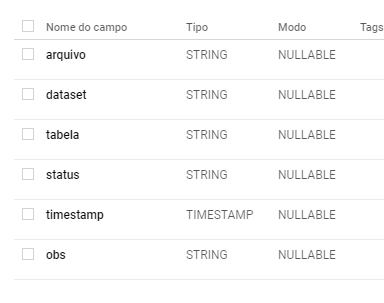

# Dataflow_use_case
Este repositório é para um caso de uso para ingestão de dados csv usando data flow, cloud storage e bigquery.

## Decisões de infraestrutura:
Dado o cenário, acredito que usar o bigquery para armazenar os dados e os logs seja mais útil para futuras análises, mas poderia ser o cloud sql o uso transacional.
Podemos conectar o data studio com a tabela de logs para monitorar a ingestão de dados.


## Modelagem conceitual:


## Começando
Para executar esse projeto será necessário:
- Projeto no google cloud platform
- Um bucket no cloud storage
- Api do dataflow ativa
- Compute Engine ou cloud shell para iniciar o dataflow
- Dataset e tabela de log

## Desenvolvimento
Para iniciar o o desenvolvimento, clone o repositório 

```shell
cd "diretorio"
git clone https://github.com/oliveiraguilhermy/dataflow_case
```

## Crie a tabela de logs no BigQuery
crie a tabela com schema abaixo:





## Configurando scripts
Edite os arquivos python com editor de código de sua preferência, substitua as variaveis de configuração comentadas do código com as inforamções de seu ambiente.


Faça upload dos scripts python e os arquivos csv para o bucket do seu projeto no google cloud

## Configuração do ambiente

Inicie cloud shell ou compute engine com uma distribuição linux.

instale o python 3

```shell
sudo apt-get update
sudo apt-get install python3.7
```
instale as bibliotecas para uso do dataflow e bigquery
```shell
pip3 install apache-beam[gcp]
pip3 install google-cloud-bigquery
```

Copie os scripts salvos no bucket para o seu ambiente

```shell
gsutil cp gs://<BUCKET>/price_ingest_dataflow.py price_ingest_dataflow.py
```

## Executando o processo
Inicie o data flow com os scripts python
```shell
python3 price_ingest_dataflow.py
```

## Conclusão 

Após rodar todos os scripts será criado 3 tabelas e a tabela de log será alimentada, assim poodemos monitorar o processo de ingestão com o data studio conectado a tabela de logs.